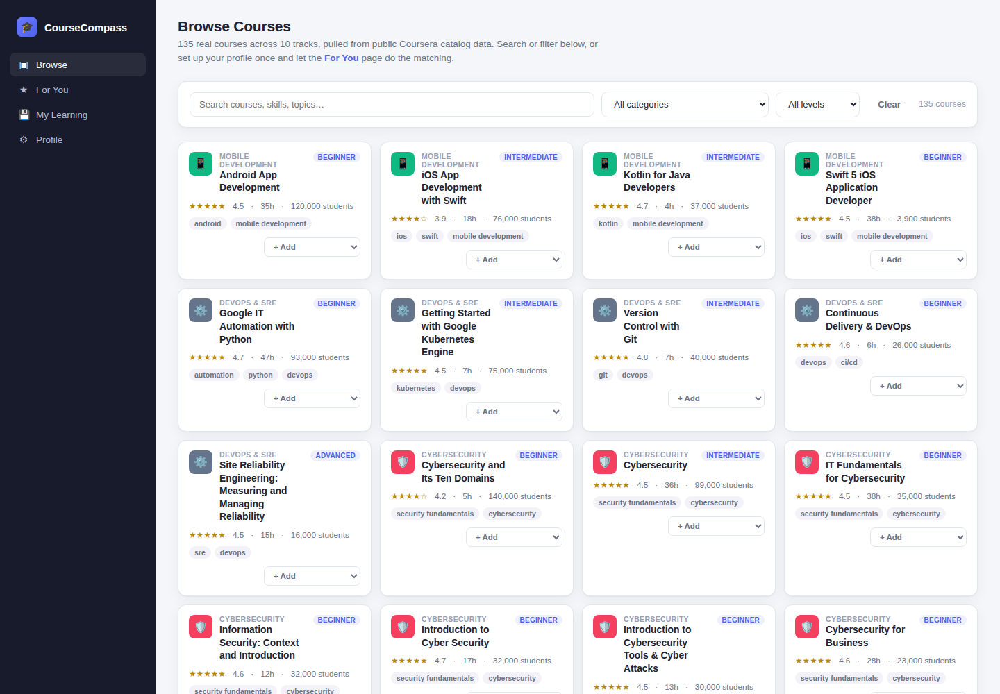
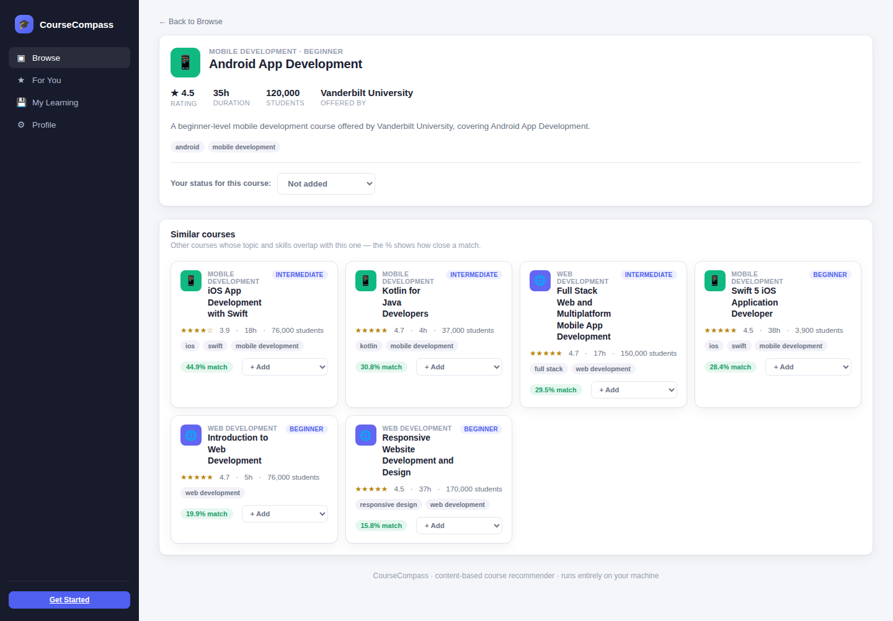
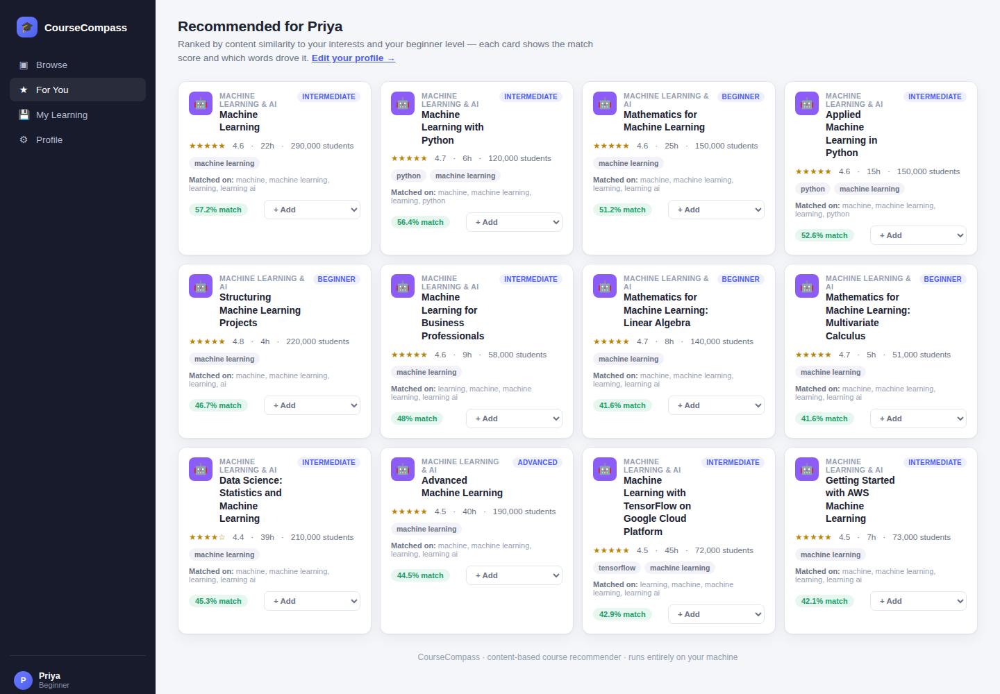
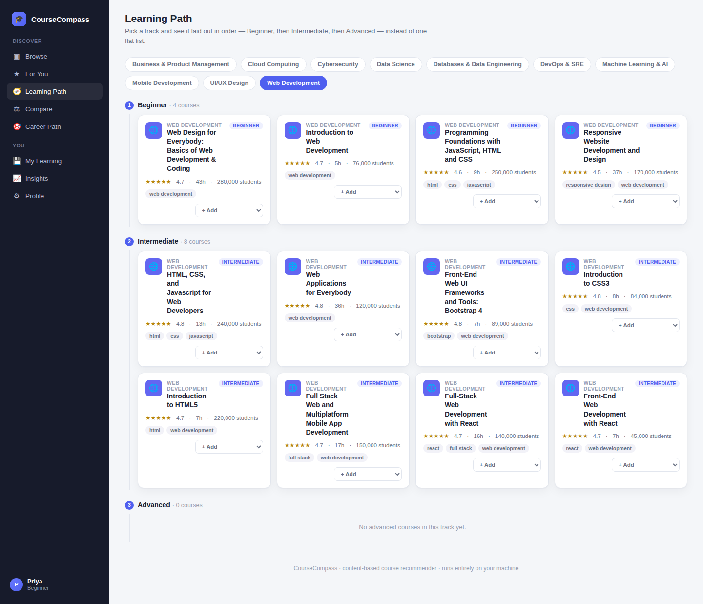
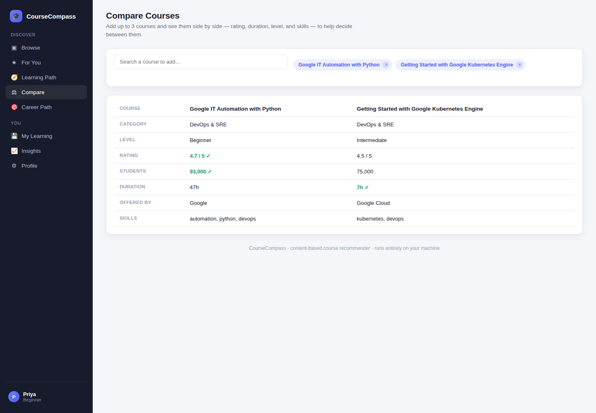
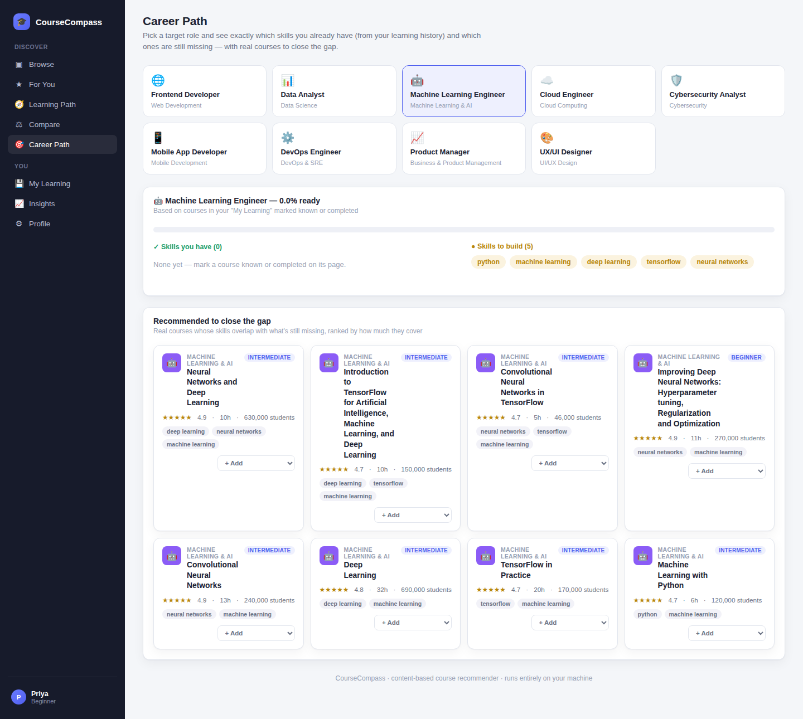
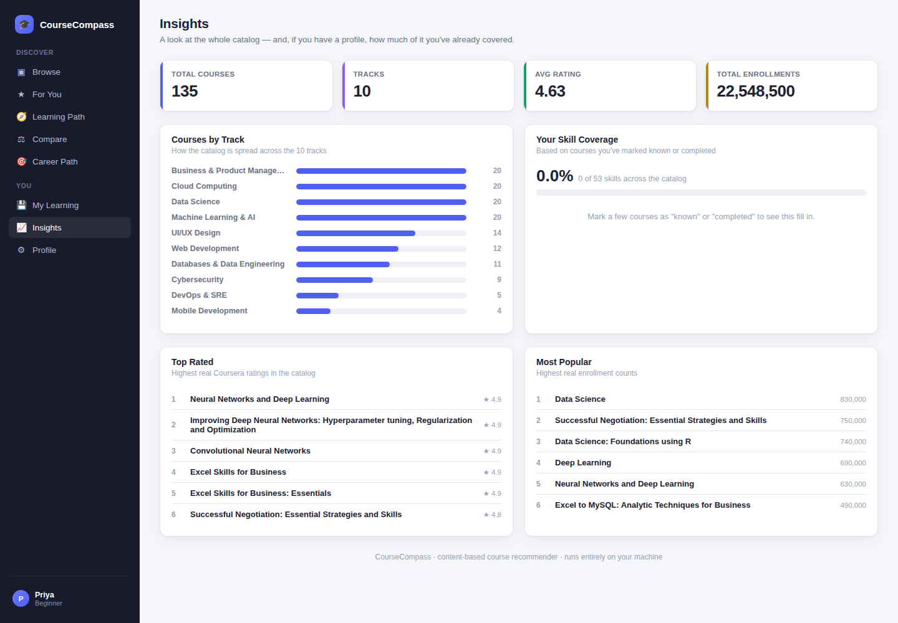

# CourseCompass

A personalized course recommendation system: pick a few interests (or the courses you
already know), and a **content-based filtering** engine — TF-IDF + cosine similarity —
ranks 135 **real Coursera courses** by how well they match, with a plain-English
explanation of *why* each one was suggested. Built as a portfolio project to demonstrate
a recommender system end to end: real data, algorithm, and a real multi-page product UI around it.



## Why this project

Most beginner ML portfolios stop at a single prediction (`is this spam? positive or
negative?`). A recommender system is a different, broader skill: it has to represent
*both* items and users in a shared space, rank a whole catalog rather than classify one
input, and explain its own reasoning — while staying fast enough to feel instant in a UI.

## How it works

**Content-based filtering**, no external API and no other users' data required:

1. **Every course becomes a vector.** Each course's title, skills, category, level, and
   description are combined into one string (title and skills repeated so they carry more
   weight than incidental words in the description), then every course in the catalog is
   fit into a single `TfidfVectorizer` — so each course becomes a point in the same shared
   "vocabulary space."
2. **A user profile becomes a vector too**, built from the interests/skills they picked
   at onboarding, plus (if they have any) the average vector of the courses they've
   marked as already known — combined the exact same way.
3. **Cosine similarity ranks every course** against that profile vector. The smaller the
   angle between two vectors, the more alike they are — this becomes the "72% match"
   score shown on each card.
4. **The same math, one course at a time, powers "Similar courses"** on each course's own
   page — cosine similarity between that one course's vector and everyone else's.
5. **"Because of: …" is not decoration.** It's the actual top overlapping weighted terms
   between the user's vector and that course's vector — if you can see it, that's really
   what drove the ranking.

No neural network, no embeddings API call, nothing that needs a GPU or an internet
connection to run. That's a deliberate choice, not a limitation — TF-IDF + cosine
similarity is fast, fully explainable, and exactly right for a catalog this size. The
natural next step (see **Roadmap** below) would be swapping the TF-IDF vectors for
learned embeddings and adding collaborative filtering once there's real user-interaction
data to train on.

## Data source — this is real, not made up

The catalog comes from a public scrape of ~890 real Coursera course listings
([Coursera Course Dataset](https://www.kaggle.com/datasets/siddharthm1698/coursera-course-dataset)
on Kaggle, mirrored on [GitHub](https://github.com/Siddharth1698/Coursera-Course-Dataset)).
A local copy lives in `data/sources/coursera_raw.csv` so the build is reproducible offline.

**Real, straight from the source, for every course:** title, offering organization
(shown as "Offered by" — e.g. Google Cloud, IBM, deeplearning.ai, Johns Hopkins
University), difficulty level, average rating, and enrollment count.

**Derived by `data/build_courses.py`**, since the raw source has no such columns at all:
category (assigned by matching real title keywords into one of the app's 10 tracks),
skill tags (extracted from words in the real title), a one-line description (title + org
+ level, not scraped text), and an estimated duration (based on the course's real
certificate type — Course / Specialization / Professional Certificate).

Some tracks have fewer real courses than others (e.g. Mobile Development only has 4)
because Coursera's own catalog — and this scrape of it — simply has less coverage there
than it does for, say, Business or Data Science. That's left as-is rather than padded
with invented courses.

## Pages

| Page | Route | What it does |
|------|-------|---------------|
| Browse | `/` | Search/filter all 135 courses by category, level, or keyword |
| Course Detail | `/course/<id>` | Full course info, content-based "Similar courses", and learner reviews |
| For You | `/recommendations` | Personalized ranked list with match % and "why" |
| Learning Path | `/learning-path` | Any track laid out as Beginner &rarr; Intermediate &rarr; Advanced, instead of one flat list |
| Compare | `/compare` | Put 2-3 courses side by side (rating, duration, level, skills) |
| Career Path | `/career-path` | Pick a target role, see which of its skills you already have vs. still need, and get courses that close the gap |
| Get Started | `/onboarding` | Pick interests, skill level, and courses you already know |
| My Learning | `/my-learning` | Saved / known / in-progress / completed courses, with stats |
| Insights | `/insights` | Catalog-wide stats (tracks, top rated, most popular) plus your own skill coverage |
| Profile | `/profile` | Edit your profile, reset it, and read how the ranking works |

No accounts, no passwords — a profile is a random id kept in a browser cookie, backed by
a small local SQLite file (`webapp/app.db`, created automatically). This keeps sign-up
frictionless while still storing real "learning history" data instead of faking it.

### Beyond the core recommender

Four features layered on top of the base "pick interests &rarr; get matches" flow, all
reusing the same catalog and TF-IDF index rather than needing anything new to be trained:

- **Learning Path** groups one track's real courses by level, so a track reads as a
  sequence to follow instead of an unordered grid.
- **Compare** puts up to 3 courses side by side and highlights the better number in each
  row (rating, students, duration) so it's not just a bigger table.
- **Career Path** is a small skill-gap tool: pick one of 9 curated target roles, and it
  diffs that role's required skills against the skill tags on courses you've marked known
  or completed, then recommends real courses that cover exactly what's still missing.
- **Insights** is a catalog-wide dashboard (courses per track, top rated, most enrolled)
  plus a personal skill-coverage bar once you have a profile.

**Reviews** on each course's detail page are a genuinely working local feature, not
placeholder content — a course starts with zero reviews and only shows ones actually
submitted through the UI, kept clearly separate from the real Coursera rating stat at the
top of the page.

<table>
<tr>
<td></td>
<td></td>
</tr>
<tr>
<td></td>
<td></td>
</tr>
<tr>
<td></td>
<td></td>
</tr>
</table>

## Tech stack

- **Python** + **pandas** — load and reshape the course catalog
- **scikit-learn** (`TfidfVectorizer`, `cosine_similarity`) — the entire recommendation engine
- **Flask** + **Jinja2** — the 10-page web app
- **SQLite** (stdlib `sqlite3`) — stores user profiles and learning history
- **Vanilla JavaScript**, no framework — card rendering, filtering, and status updates via `fetch()`
- **pytest** — automated tests for both the recommender and the data store

## Project structure

```text
course-recommender/
├── data/
│   ├── sources/
│   │   └── coursera_raw.csv Real ~890-course Coursera scrape (see "Data source" above)
│   ├── build_courses.py     Builds courses.csv from the real source data above
│   └── courses.csv          135 real courses across 10 tracks
├── src/
│   └── recommender.py       The whole recommendation engine (TF-IDF index, similarity, ranking)
├── webapp/
│   ├── app.py                Every route: pages + JSON APIs, incl. career tracks data
│   ├── store.py              SQLite: profiles, course statuses, and learner reviews
│   ├── templates/            One Jinja2 template per page, sharing base.html's sidebar
│   └── static/               style.css, one JS file per page, plus shared common.js
├── tests/
│   ├── test_recommender.py   Recommender correctness (similarity, ranking, exclusions)
│   └── test_store.py         Profile/course-status persistence + reviews
├── requirements.txt
└── README.md
```

## Run it

Requires Python 3.10+.

```bash
python -m venv .venv
source .venv/bin/activate      # Windows: .venv\Scripts\activate
pip install -r requirements.txt

python -m webapp.app
```

Open `http://127.0.0.1:5057`. There's no separate "training" step — the TF-IDF index
builds itself in memory the first time the app needs it (well under a second for 135
courses) and stays cached for the life of the process.

## Test

```bash
pytest
```

13 tests cover the recommender (catalog size, similarity exclusions, ranking relevance,
the "known courses get excluded" rule, the popular-courses fallback with no signal yet)
and the SQLite store (create/update/delete a profile, upsert a course status, cascade
delete, adding and reading back reviews).

## Design notes / decisions worth knowing about

- **Why TF-IDF over raw counts?** TF-IDF down-weights words that appear in almost every
  course (like "learn" or "build") and up-weights words that are actually distinctive to
  a course — without that, generic words would dominate every similarity score.
- **Why exclude known/completed courses from recommendations, but not from "Similar
  courses"?** "For You" is meant to surface something new; a course's own detail page
  is about *that* course, so showing a similar one you've already finished is still
  useful context (and it's excluded there too, if you're logged in — see
  `similar_courses(..., exclude_ids=...)`).
- **Why a skill-level "bonus" instead of a hard filter?** A hard filter can hide a
  genuinely great match just because of its label. The bonus (`+0.05` similarity) only
  reorders courses that were already close in relevance — it never promotes an unrelated
  course over a relevant one.
- **Why no real login?** This is a portfolio project focused on the recommender itself —
  a cookie-backed anonymous profile shows the same "personalization + learning history"
  data modeling as real accounts would, without adding password handling that isn't the
  point of the project.

## Roadmap (the brief's own next step)

- **Embeddings.** Swap TF-IDF vectors for sentence embeddings (e.g. a local
  `sentence-transformers` model) to catch semantic matches TF-IDF misses (e.g. "cloud
  computing" vs. "distributed infrastructure").
- **Collaborative filtering.** Once there's real usage data, blend in "students who
  completed X also completed Y" — content-based and collaborative signals typically
  outperform either alone (a classic hybrid recommender).
- **Implicit feedback.** Weight a course a user spent time on more than one they just
  glanced at, instead of only using explicit "known/completed" marks.
